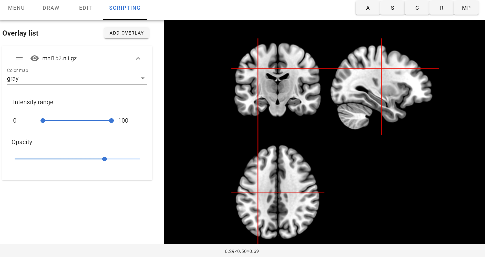
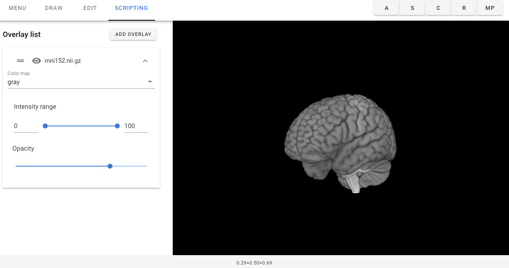
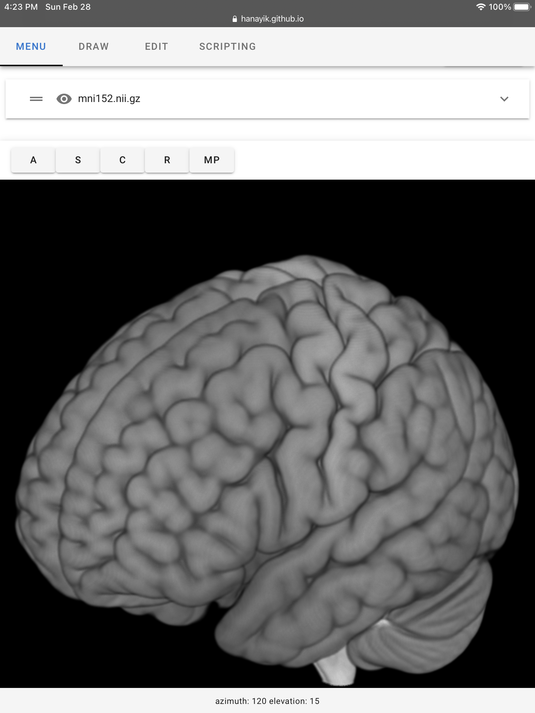
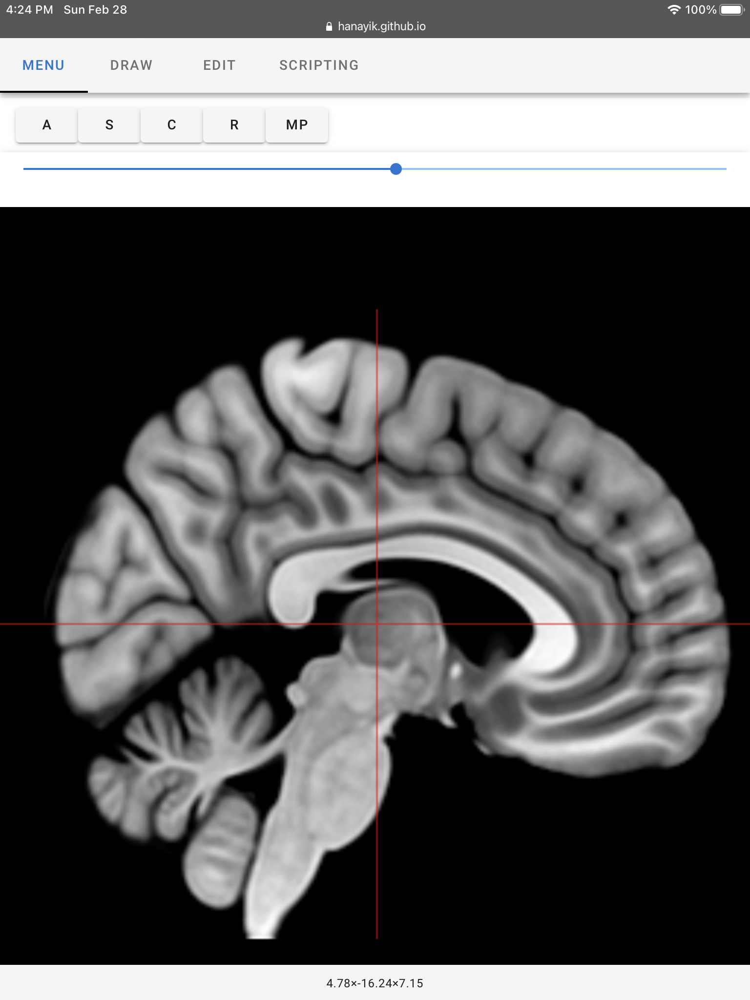

# NiiVue

**WARNING: THIS IS A WORK IN PROGRESS**

- [Overview]()
- [Development Environment]()
- [Usage]()

## Overview

NiiVue is a minimalist webgl [nifti](https://nifti.nimh.nih.gov) image viewer (for now). 

The goal is to have a simple viewer component that can be embedded in an existing web page. The component can be simply embedded into any web page. Optionally, the component can be controlled by other widgets on the web page, for example controls that allow the user to set the contrast, color scheme and other properties. 

## Live View 

[Load a NiiVue web page](https://hanayik.github.io/niivue/)

## Example screenshots

### Desktop Browsers

#### Chrome





### Mobile Browsers

#### Android


#### iOS






## Requirements

- WebGL2 enabled browser (Chrome, FireFox or Safari Technology Preview).

## To Do

- allow mouse based slice scrolling
- allow overlays
- volume rendering

## Contributors

- Taylor Hanayik
- Chris Rorden

## Development Environment

### Development Installation

```
# You must install nodejs on your system FIRST!

# Use https protocol if needed
git clone --recurse-submodules git@github.com:hanayik/niivue.git

# webgl-util is a git submodule so the command above clones that too

cd niivue

npm install
```

### Compiles and hot-reloads for development
```
# nifti files are stored in /public
npm run serve
```

### Compiles and minifies for production
```
npm run build
```

### Lints and fixes files
```
npm run lint
```

### Customize configuration
See [Configuration Reference](https://cli.vuejs.org/config/).

## Core data loading concepts

`niivue.js` functions should be designed to accept an `overlayList` (Array) such as:

```
overlayList: [
    {
      volumeURL: "./mni152.nii.gz",
      volume: {hdr: null, img: null},
      name: "mni152.nii.gz",
      intensityMin: 0,
      intensityMax: 100,
      intensityRange:[0, 100],
      colorMap: "gray", // gray
      opacity: 100,
    },
    {
      volumeURL: "./chris_T1.nii.gz",
      volume: {hdr: null, img: null},
      name: "chris_T1.nii.gz",
      intensityMin: 0,
      intensityMax: 100,
      intensityRange:[0, 100],
      colorMap: "gray", // gray
      opacity: 100,
    }
]

```

This `overlayList` informs niivue WebGL calls about most rendering related settings. For now, only the first item in the array is rendered until overlays (layering) is actually supported. 


